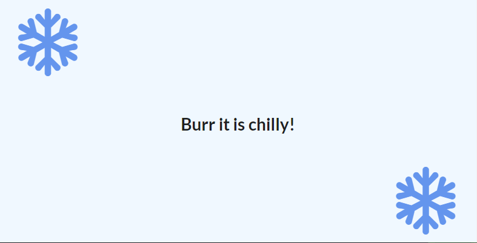

# _react-apps
 Just some application to learn React js

#Apps

### 1. learn-react-app

> In the first app, I just have created a simple example with social media comments.
> 
> 
### 2. seasons
> In the second example, I have created a page that can change background, text, and icon, depending on the season. It can do that with your location. At the end I have added a realtime clock, to practice componentDidUpdate method.
> 
> ***Winter***
> 
> ***Summer***
> 
> ***Real time clock***
> 
> 
### 3. Search images from unsplash

